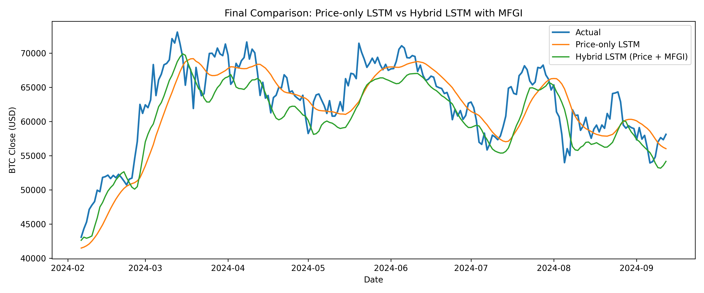
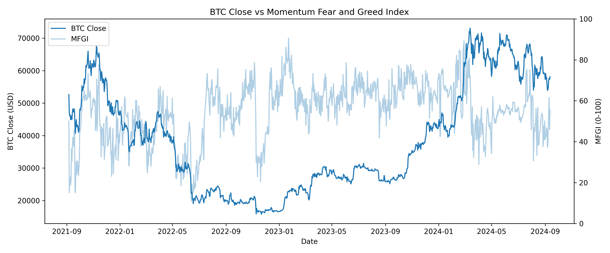
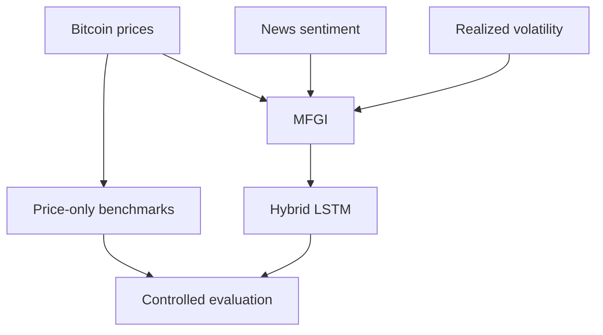
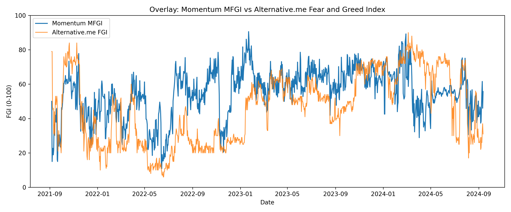

# Momentum AI

Transparent, sentiment-aware Bitcoin forecasting with time-series models, deep learning, and behavioral market signals.

Developed as my 2026 Senior Independent Study thesis in Computer Science at The College of Wooster.

[](https://www.python.org/)
[](https://www.tensorflow.org/)
[](docs/Momentum_AI_Thesis.pdf)
[](#research-paper)



## Overview

Momentum AI studies whether behavioral market context can improve short-term Bitcoin forecasting beyond historical prices alone. The project compares traditional and deep learning models and introduces the **Momentum Fear & Greed Index (MFGI)**, a transparent market indicator built from price momentum, realized volatility, and Bitcoin news sentiment.

The work addresses three questions:

1. Which forecasting models perform best under consistent evaluation conditions?
2. Do lagged sentiment-aware features improve forecasting beyond price history alone?
3. Can a deep learning forecasting pipeline remain transparent and interpretable?

## Key Result

In a controlled LSTM comparison, adding lagged MFGI features reduced error across all three evaluation metrics.

| Model | MAE (USD) | RMSE (USD) | MSE (USD²) |
|---|---:|---:|---:|
| Price-only LSTM | 2,943.08 | 3,812.38 | 14,534,245.23 |
| **Hybrid LSTM + lagged MFGI** | **2,930.37** | **3,589.96** | **12,887,839.72** |

**RMSE decreased by 5.83% and MSE decreased by 11.33%.** The improvement is modest but consistent, suggesting that transparent behavioral context can help reduce larger forecasting errors.

## How MFGI Works

The MFGI is a fully reproducible 0-100 index. Lower values represent fear-like market conditions, while higher values represent greed-like conditions.

| Component | Weight | Signal |
|---|---:|---|
| Momentum | 40% | Directional price strength relative to a 30-day moving average |
| Volatility | 30% | Market stability derived from 30-day realized volatility |
| News sentiment | 30% | Daily aggregate sentiment from Bitcoin news headlines |

```text
MFGI = 0.40(Momentum Score) + 0.30(Volatility Score) + 0.30(Sentiment Score)
```

Expanding-window normalization is used so each date is scaled only with information available up to that point. One-, two-, and three-day lagged MFGI values provide the hybrid LSTM with behavioral context without using future information.



## Forecasting Pipeline



The project evaluates four forecasting settings:

- **Naive persistence** as the minimum performance baseline
- **ARIMA** as a traditional statistical time-series model
- **Price-only LSTM** as the deep learning benchmark
- **Hybrid LSTM + lagged MFGI** as the sentiment-aware model

## Results

### Price-only benchmark

| Model | MAE (USD) | RMSE (USD) | MSE (USD²) |
|---|---:|---:|---:|
| **Naive persistence** | **1,433.10** | **2,017.70** | **4,071,107.29** |
| ARIMA(3, 1, 2) | 18,538.71 | 24,727.77 | 611,462,604.17 |
| Price-only LSTM | 2,824.59 | 3,720.86 | 13,844,799.22 |

The naive model performed best on the shared price-only test window. This result shows how difficult it is for complex models to beat short-term price persistence.

### Transparent index comparison

The MFGI was also compared with the Alternative.me Fear & Greed Index. The two indices do not match day by day, but they show similar broad market regimes. Unlike the proprietary benchmark, the MFGI exposes every input, transformation, and weighting decision.



## Research Paper

**Momentum AI: A Comparative Analysis of Time-Series and Deep Learning Models for Cryptocurrency Forecasting Using Sentiment-Enhanced Indices**

The full 86-page thesis covers the research design, related work, model development, MFGI construction, controlled experiments, interpretability, limitations, and future work.

**[Read the full thesis](docs/Momentum_AI_Thesis.pdf)**

## Repository Structure

```text
momentumfgi/
├── README.md
├── docs/
│   └── Momentum_AI_Thesis.pdf
├── data/
│   └── alternative_me_fgi.csv
├── figures/
│   ├── naivechfin.png
│   ├── arimafin.png
│   └── lstmfin.png
├── MFGIFIGS2/
│   ├── final_model_comparison.csv
│   ├── final_lstm_comparison_plot.png
│   └── ...
├── naive.py
├── arima.py
├── lstm.py
├── MFGI.py
├── bitcoin_sentiments_21_24.csv
└── requirements.txt
```

## Getting Started

```bash
git clone https://github.com/SelormEssey/momentumfgi.git
cd momentumfgi

python3 -m venv .venv
source .venv/bin/activate
pip install -r requirements.txt
```

Run an individual benchmark:

```bash
python naive.py
python arima.py
python lstm.py
```

Run the complete sentiment, MFGI, and hybrid LSTM pipeline:

```bash
python MFGI.py
```

The scripts download BTC-USD market data at runtime. `MFGI.py` uses the included sentiment dataset and the cached Alternative.me index data in `data/`.

## Methodology Notes

- Chronological train-test splits preserve temporal order.
- Lagged MFGI features prevent same-day behavioral information from leaking into the forecast target.
- Expanding-window normalization reduces look-ahead bias in index construction.
- MAE, RMSE, and MSE measure both typical and large forecasting errors.
- Fixed random seeds improve reproducibility in the hybrid model comparison.

## Limitations and Future Work

Cryptocurrency prices are noisy, non-stationary, and sensitive to external events. Future extensions could include on-chain indicators, search-interest data, social media sentiment, derivatives signals, regime-specific evaluation, additional cryptocurrencies, and transformer-based forecasting.

## Author

**Selorm Essey**

M.S. Computer Science, Emory University · B.A. Computer Science, The College of Wooster

[LinkedIn](https://www.linkedin.com/in/selormessey/) · [GitHub](https://github.com/SelormEssey)
